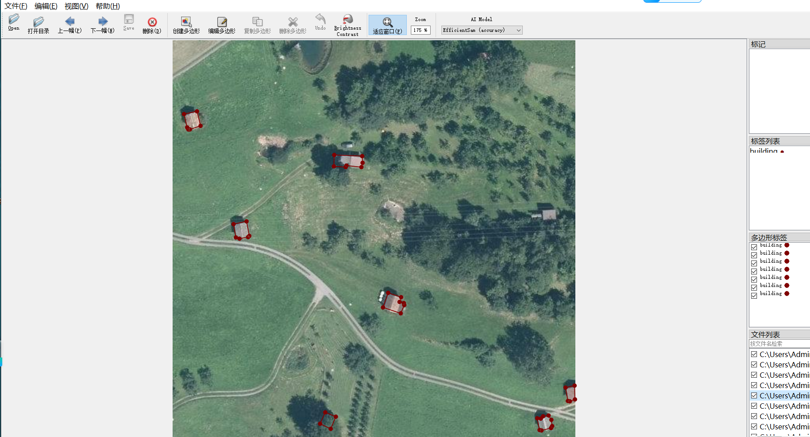
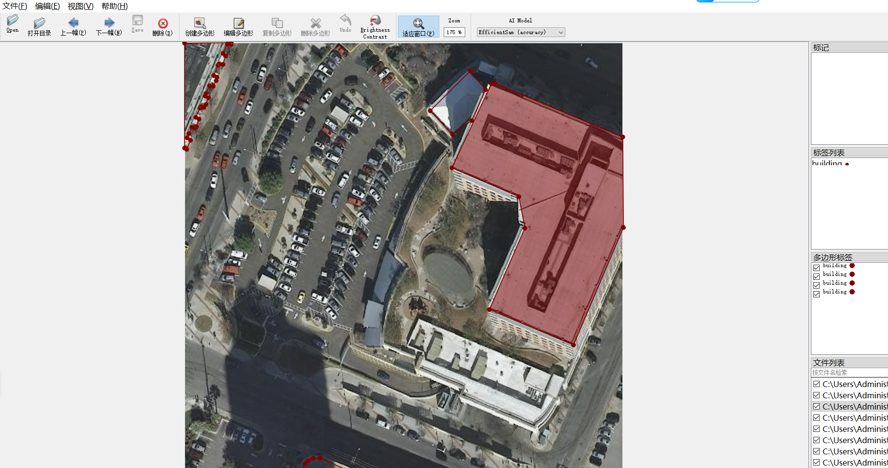
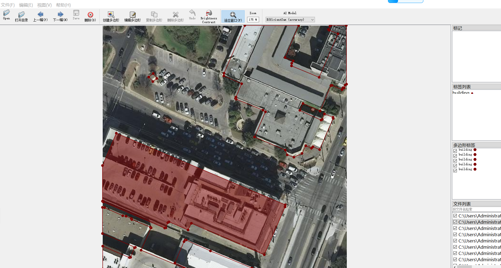

# Aerial Building Segmentation Dataset 2850 imagesjsonformat

Aerial Building Segmentation Dataset (2850 images, JSON format)

This is a high-resolution aerial image dataset of buildings, with 2850 images in JSON format. The dataset contains various types of buildings, such as residential, commercial, and industrial buildings, and covers various architectural styles and designs. The resolution of the images ranges from 1080p to 4K, providing users with detailed information about the building's appearance, structure, and surrounding environment. This dataset can be used for building analysis, urban planning, architecture design, and other related research topics.

The aerial photography building dataset contains 2850 high resolution aerial photographs designed for building instance segmentation and semantic segmentation tasks. It is suitable for urban planning, geographic information system (GIS) updates, disaster assessment, and training of computer vision models.

The dataset images are mainly collected in urban, suburban and urban-rural areas, covering dense residential areas, industrial zones, independent buildings and other types of buildings and layouts, with good geographical diversity and scene representativeness. All images have been professionally annotated, and the outline boundaries of each building are accurately drawn.

The core annotation information is stored in standard JSON format, with clear and easy-to-parse structure. Each JSON file corresponds to an image, detailing the instance information of all buildings in the image, including a unique object ID and category labels (such as "building"). The coordinates of pixels forming the polygon outline are also recorded. This format is compatible with mainstream deep learning frameworks (such as TensorFlow and PyTorch) and annotation tools (such as LabelMe and CVAT), facilitating data loading and preprocessing.

The dataset has high-quality annotations and standardized format, which makes it an ideal choice for training U-Net, Mask R-CNN, DeepLab and other segmentation models. Researchers can directly use the JSON file to generate pixel-level mask labels, quickly build the training set. With a scale of 2850 images, it is not only suitable for model training effect but also suitable for algorithm validation and prototype development on general hardware, making it a very valuable open source resource in the field of remote sensing image analysis.

## Images

---

Here is a pay link on Stripe (https://buy.stripe.com/3cs8yP7sY87d0vu9AB). Please contact me lonlonago@foxmail.com after funding $89, and I will send you a complete data files, thank you!

